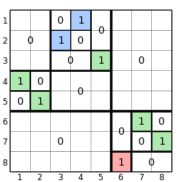
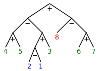
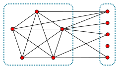
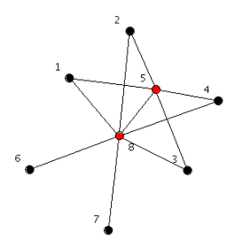
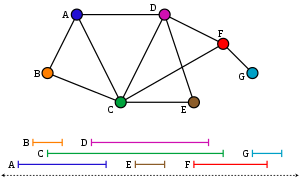
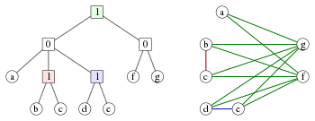
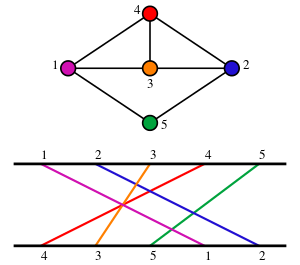

#### Separable permutations
**definition:**
Bose, Buss & Lubiw (1998) define a separable permutation to be a permutation that has a separating tree: a rooted binary tree in which the elements of the permutation appear (in permutation order) at the leaves of the tree, and in which the descendants of each tree node form a contiguous subset of these elements. Each interior node of the tree is either a positive node in which all descendants of the left child are smaller than all descendants of the right node, or a negative node in which all descendants of the left node are greater than all descendants of the right node. 

**figure:** matrix representation of a separable permutation (the blocks of a separable permutation are separable permtations).

**figure:** tree representation of the same separable permutation.

**good characterization:**
a permutation is separable if and only if it contains neither $2413$ nor $3142$ as a pattern. (a permutation pattern is a sub-permutation of a longer permutation. Any permutation may be written in one-line notation as a sequence of digits representing the result of applying the permutation to the digit sequence $123...$; for instance the digit sequence $213$ represents the permutation on three elements that swaps elements $1$ and $2$. If $\pi$ and $\sigma$ are two permutations represented in this way, then $\pi$ is said to contain $\sigma$ as a pattern if some subsequence of the digits of $\pi$ has the same relative order as all of the digits of $\sigma$.)

**references:**
https://en.wikipedia.org/wiki/Separable_permutation

#### 2-SAT
**good characterization:**
a 2-CNF formula is satisfiable if and only if there is no variable that belongs to the same strongly connected component of the implication graph as its negation.
The implication graph of a 2-SAT formula is a directed graph in which there is one vertex per variable or negated variable, and an edge connecting one vertex to another whenever the 2CNF contains a clause enforcing an implication between the two literals. An implication graph is always skew-symmetric, i.e., it has a symmetry that takes each variable to its negation and reverses the orientations of all of the edges.
Clearly, we do nt actually need to really disturb the implication graph in order to display the impliational circularity that proves the the formula is not satisfiable.
Also, it is easy to extend this characterization to the case when the 2-CNF can also have unit clauses.

**references:**
https://en.wikipedia.org/wiki/2-satisfiability

#### Laminar and cross-free families
**definition:**
We consider a family $\mathcal{F}$ of subsets of an $n$-element set $V=\{1,2,\ldots,n\}$. Two subsets $F_1,F_2\in \mathcal{F}$ overlap if all three of the sets $F_1\cap F_2$, $F_1\setminus F_2$ and $F_2\setminus F_1$ are not empty. Two subsets $F_1,F_2\in \mathcal{F}$ cross if they overlap and $V\setminus F_1\setminus F_2$ is also not empty. We call \mathcal{F} an overlap-free family (resp. cross-free family) if no two members of the family overlap (resp. cross). Overlap-free families are also known as laminar families.

**good characterization:**
Theorem [Edmonds–Giles] A family is cross-free if and only if it has an unrooted tree representation, and overlap-free if and only if it has a rooted tree representation.

As for laminar families: a rooted tree representation is a tree whose nodes are the members of $\mathcal{F}$ and the father contains its children.

**references:**
https://www.sciencedirect.com/science/article/pii/S0195669811001806

#### progressively finite games on DAGs

Given a DAG and a pebble placed on one of its nodes, two player take turn in moving the pebble along an arc. When the pebble sits in a sink node, the player in turn can not move and loses the game.
Prove that a given game situation (DAG + pubble position) is a win or a loss by providing the kernel and a winning strategy for the winner.

#### a progressively finite game on bipartite graph whose solution rests on matching theory

**game description:**
Nick and Peter play the following game. They draw an undirected bipartite graph G on a sheet of paper, and put a token to one of its vertices. After that they make moves in turn. Nick moves first.

A move consists of moving the token along the graph edge. After it the vertex where the token was before the move, together with all edges incident to it, are removed from the graph. The player who has no valid moves loses the game.

**winning strategy:**

Proposition. Nick (the first player) wins starting from vertex v iff this vertex belongs to every possible maximum matching of the given graph. We will prove it in two steps.

If there is a maximum matching without v, Nick loses.
Indeed, since the matching is maximum, there is no augmenting path from v. That means every simple odd-length path from v can be prolonged by an edge of the matching. In terms of our problem, it means the game can be continued by Peter after every Nick's move.

If there is no maximum matching without v, Nick wins.
Consider any possible maximum matching. Move along the edge of this matching from v to, say, u. Now, the initial matching minus the edge u-v is a maximum matching of the remaining graph which does not include u. As we know from step 1, the player to move now (which is Peter) is at a loss.

**non bipartite graphs:**

The solvability in P of this game and its link to matching theory actually holds also for non-bipartite graphs. On non-bipartite graphs one has to rest on the Edmonds-Gallai decomposition of the graph.

#### Mazes

In a maze, provide either the certificate that you can go oform A to B (by providing a path) or a certificate that you can not (by providing a wall that separates A from B).

**more compex questions/variations:**

1. the graph could be directed or mixed (= only some of the arcs are directed);
2. we could ask to prove that to go from A to B you must necessarily go through C;
3. we could ask whether A,B,C can be visited in this order.

#### Split graphs
**definition:** a split graph is a graph in which the vertices can be partitioned into a clique and an independent set.

**figure:** a split graph (the nodes on the left induce a clique, those on the right an independent set).

**good characterization:**
a graph is split if and only if no induced subgraph is a $C_4$ or $C_5$ (cycle on four or five vertices), or a pair of disjoint edges (the complement of a $C_4$).
**references:**
https://en.wikipedia.org/wiki/Split_graph#:~:text=In%20graph%20theory%2C%20a%20branch,Tyshkevich%20and%20Chernyak%20(1979).

#### Threshold graphs
**definition:** a graph $G=(V,E)$ is a threshold graph if there are a real number $S$ and for each vertex $v$ a real vertex weight $w(v)$ such that for any two vertices $u,v$ in $V$, $uv$ is an edge in $E$ if and only if $w(u)+w(v)> S$.
**good characterization:**
a threshold graph is a graph with no induced $P_4$, $C_4$ nor $2K_2$.
**equivalent definition:**
a threshold graph is a graph that can be constructed from a one-vertex graph by repeated applications of the following two operations:
* Addition of a single isolated vertex to the graph.
* Addition of a single universal vertex to the graph, i.e. a single vertex that is connected to all other vertices.

**figure:** ordered construction of a threshold graph (each red vertex is univeral when added)

**a remarkable encoding:**
Since no graph can contain both an isolated and an universal vertex, and everly Threshold graph contains at least one of the two, then unlabeled threshold graphs can be uniquely described by means of a string of symbols. $\epsilon$ is always the first character of the string (whence can be omitted if the empty graph is not of interest), and represents the first vertex of the graph. Every subsequent character is either $u$, which denotes the addition of an isolated vertex (or union vertex), or $j$, which denotes the addition of a dominating vertex (or join vertex). For example, the string $\epsilon uuj$ represents a star graph with three leaves, while $\epsilon uj$ represents a path on three vertices. The graph of the figure can be represented as $\epsilon uuujuuj$
**references:**
https://en.wikipedia.org/wiki/Threshold_graph

#### Interval graphs
**definition:** an interval graph is an undirected graph formed from a set of intervals on the real line, with a vertex for each interval and an edge between vertices whose intervals intersect.

**figure:** the interval graph of a family of intervals of the real line (every interval is repreented by a node adjacent to all the intervals it intersects)

**good characterization:**
A graph is an interval graph if and only if it is chordal and AT-free.
Three vertices form an asteroidal triple (AT) in a graph if, for each two, there exists a path containing those two but no neighbor of the third. A graph is AT-free if it has no asteroidal triple.
**a remarkable subclass:**
Proper interval graphs are interval graphs that have an interval representation in which no interval properly contains any other interval; unit interval graphs are the interval graphs that have an interval representation in which each interval has unit length. A unit interval representation without repeated intervals is necessarily a proper interval representation. Not every proper interval representation is a unit interval representation, but every proper interval graph is a unit interval graph, and vice versa. Every proper interval graph is a claw-free graph; conversely, the proper interval graphs are exactly the claw-free interval graphs.
**references:**
https://en.wikipedia.org/wiki/Interval_graph

#### Chordal graphs
**definition:** a chordal graph is one in which all cycles of four or more vertices have a chord, which is an edge that is not part of the cycle but connects two vertices of the cycle. Equivalently, every induced cycle in the graph should have exactly three vertices. 
**good characterizations:**
1. chordal graphs are those graphs that have perfect elimination orderings, as the graphs in which each minimal separator is a clique
2. chordal graphs are the intersection graphs of subtrees of a tree.

**references:**
https://en.wikipedia.org/wiki/Chordal_graph

#### Comparability graphs
**definition:** a comparability graph is an undirected graph that connects pairs of elements that are comparable to each other in a partial order.
Equivalently, a comparability graph is a graph that has a transitive orientation, i.e., an assignment of directions to the edges of the graph (i.e., an orientation of the graph) such that the adjacency relation of the resulting directed graph is transitive: whenever there exist directed edges $(x,y)$ and $(y,z)$, the edge $(x,z)$ is present.
**good characterization:**
   graph $G$ is a comparability graph if and only if for every generalized cycle of odd length, one can find an edge connecting two vertices that are at distance two in the cycle. Such an edge is called a triangular chord. In this context, a generalized cycle is defined to be a closed walk that uses each edge of the graph at most once in each direction.
**references:**
https://en.wikipedia.org/wiki/Comparability_graph

#### Cographs
**definition:** Any cograph may be constructed using the following rules:
1. any single vertex graph is a cograph;
2. if $G$ is a cograph, so is its complement graph $\overline{G}$;
3. if $G$ and $H$ are cographs, so is their disjoint union $G\cup H$.
**good characterization:**
   graph $G$ is a cograph iff $G$ contains no induced $P_4$.
**remarkable representation: Cotrees**

**figure:** A cotree and the corresponding cograph. Each edge $uv$ in the cograph has a matching color to the least common ancestor of $u$ and $v$ in the cotree.

A cotree is a tree in which the internal nodes are labeled with the numbers $0$ and $1$. Every cotree $T$ defines a cograph G having the leaves of $T$ as vertices, and in which the subtree rooted at each node of $T$ corresponds to the induced subgraph in $G$ defined by the set of leaves descending from that node:
* A subtree consisting of a single leaf node corresponds to an induced subgraph with a single vertex.
* A subtree rooted at a node labeled 0 corresponds to the union of the subgraphs defined by the children of that node.
* A subtree rooted at a node labeled 1 corresponds to the join of the subgraphs defined by the children of that node; that is, we form the union and add an edge between every two vertices corresponding to leaves in different subtrees. Alternatively, the join of a set of graphs can be viewed as formed by complementing each graph, forming the union of the complements, and then complementing the resulting union.
An equivalent way of describing the cograph formed from a cotree is that two vertices are connected by an edge if and only if the lowest common ancestor of the corresponding leaves is labeled by $1$. Conversely, every cograph can be represented in this way by a cotree. If we require the labels on any root-leaf path of this tree to alternate between $0$ and $1$, this representation is unique.
**references:**
https://en.wikipedia.org/wiki/Cograph

#### Permutation graphs
**definition:** a permutation graph is a graph whose vertices represent the elements of a permutation, and whose edges represent pairs of elements that are reversed by the permutation. Permutation graphs may also be defined geometrically, as the intersection graphs of line segments whose endpoints lie on two parallel lines.

**figure:** A permutation graph represented as intersection graph of a family of lines.

**good characterization (implicit):**
   graph $G$ is a permutation graph if and only if both $G$ and its complement $\overline{G}$ are comparability graphs.
**references:**
https://en.wikipedia.org/wiki/Permutation_graph

