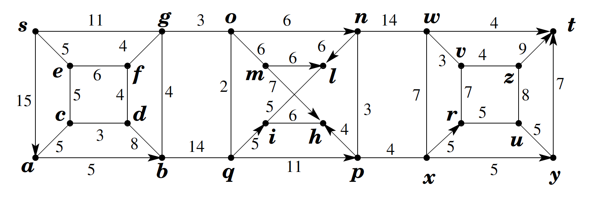

## Teoria dei Grafi - Cammini minimi##

Si consideri il grafo $G$, con pesi sugli archi, riportato in figura:

__Richieste__:
1. __\[1 pt\]__ Calcolare la distanza di $x$ da $s$
2. __\[1 pt\]__ Fornire le distanze di ciascun nodo da $s$
3. __\[1 pt\]__ Fornire un cammino minimo da $s$ a $x$
4. __\[1 pt\]__ Fornire un albero dei cammini minimi dal nodo $s$ a tutti gli altri nodi del grafo
5. __\[2 pt\]__ Specificare quanti siano i possibili alberi dei cammini minimi dal nodo $s$ a tutti gli altri nodi del grafo
6. __\[3 pt\]__ Descrivere in modo chiaro e conciso la struttura della famiglia degli alberi dei cammini minimi
